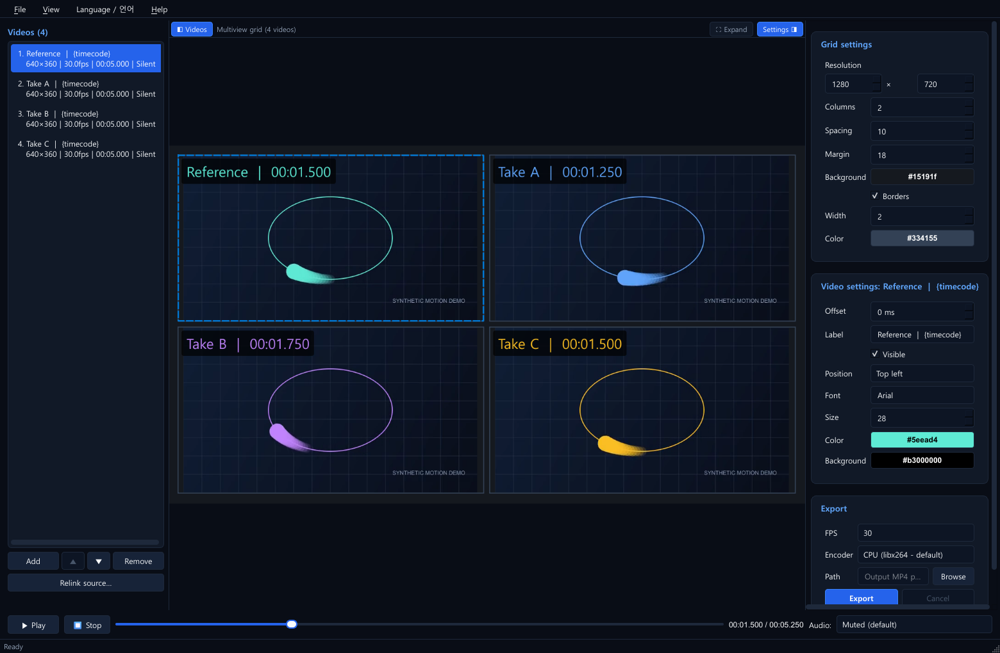

# SyncView

[한국어](README.md) | **English**

## Compare in one view. Share one video.

Play your clips together, align their start times, and label the results. **SyncView is a Windows desktop tool that takes local videos from comparison to a shareable MP4.**

**One playback bar · Per-video timing · Editable projects · Local processing**

[Run SyncView](#run-without-installing-dependencies) · [Workflow](#workflow) · [Shortcuts](#keyboard-shortcuts) · [Changelog](CHANGELOG.md) · [Fit and alternatives](docs/POSITIONING.md) (Korean)

*Four synthetic test clips playing in the actual application. Per-video labels and timecodes can also appear in the exported MP4.*

## When to use it

| Your task | What you can produce |
|---|---|
| Compare model outputs, filters, or rendering variants | A single view of multiple candidates, with settings identified by labels |
| Compare takes that start at different times | Shared playback with manually adjusted offsets for each video |
| Prepare a review, presentation, or feedback clip | One MP4 that viewers can play without installing SyncView |
| Revisit the same comparison later | A JSON project retaining order, layout, timing, and styling |

Using the app requires no account or video upload, and source files stay untouched. Mix portrait and landscape footage while preserving aspect ratios. Korean labels and file paths containing Korean characters or spaces are supported.

**Getting started:** Windows x64 with English and Korean UI. Switch instantly through **Language / 언어**; your choice is remembered. The first launch uses Korean on a Korean-language system and English otherwise. For pixel-level quality analysis or frame-accurate measurement, review the [scope and limitations](#scope-and-limitations) first.

## Run without installing dependencies

If you have a portable package, **extract the entire ZIP and run SyncView/SyncView.exe**. No separate Python or FFmpeg installation is needed. Keep the `_internal` folder beside the EXE. See the bilingual [quick start](docs/QUICKSTART.md).

This repository currently provides source code; **a public portable ZIP has not been published yet**. Portable builds have been validated locally. Public downloads will follow completion of the [third-party licensing materials](docs/LICENSING.md). To run from source, follow the development setup below.

## Features

| Feature | Description |
|---|---|
| Multiview grid | Add, remove, and reorder videos; use automatic layout or choose the number of columns; preserve source aspect ratios |
| Synchronized playback | Play, pause, and seek all videos together; set per-video offsets in milliseconds; hold the last frame of shorter videos |
| Appearance | Configure background color, spacing, margins, borders, and per-video labels, fonts, sizes, colors, and positions |
| Label macros | Insert filenames, timecodes, frame rates, resolutions, and offsets into labels |
| Preview controls | Double-click a cell for solo view; hide side panels to expand the preview |
| Audio | Muted by default; select one video's audio for both preview and export |
| Projects | Save and restore JSON projects, store relative paths, and relink moved or missing source files |
| MP4 export | H.264/AAC output at 24, 30, or 60 fps; configurable dimensions; progress and cancellation; preserve existing output on failure |
| Encoders | CPU encoding with libx264 by default; optional NVIDIA NVENC and Intel QSV |
| Standalone build | Build a single SyncView.exe containing Python and the required media tools |
| Languages | Switch instantly between English and Korean, remember the choice, and use a built-in guide in either language |

## Workflow

1. Click **추가 (Add)** or drag and drop video files into the application.
2. Reorder videos with the ▲ and ▼ buttons, then adjust the grid and output dimensions in the right panel.
3. Select a video to edit its offset, label, and font.
4. Use the playback bar to preview the composition and optionally select an audio source.
5. Choose **파일 → 저장 (File → Save)** to save the project. If a source file has moved, select its video and use **원본 다시 연결 (Relink source)**.
6. Choose the output path, frame rate, and encoder, then click **내보내기 (Export)**.

Project files do not contain the videos themselves. When moving a project to another computer, also transfer the source files or relink them.

### Timing and labels

**Source time = shared timeline time − offset.** An offset of +1000 ms starts the source from its beginning at timeline time 1 second. An offset of -1000 ms skips the first second of the source. Cells display the background before their start time and hold their last frame after playback ends. The total timeline ends when the last video finishes, accounting for offsets.

| Macro | Example |
|---|---|
| {filename} | Front_Camera |
| {timecode} | 00:12.300 — the video's current source time |
| {fps} | 30fps |
| {resolution} | 1920x1080 |
| {offset} | 1000ms |

Example: {filename} [{timecode}]. Timecodes update during export as well as preview. Long labels are shortened with an ellipsis to fit their cells.

### Keyboard shortcuts

| Key | Action |
|---|---|
| Space | Play / pause |
| ← / → | Seek backward / forward by 100 ms |
| Shift + ← / → | Seek backward / forward by 1 second |
| Home | Go to the beginning |
| M | Align the selected video's start with the current timeline position |
| Delete | Remove the selected video |
| Ctrl+N / Ctrl+O / Ctrl+S | New project / open / save |
| Ctrl+Shift+S | Save as |
| Ctrl+1 / Ctrl+2 | Toggle the video list / settings panel |
| F11 | Hide or restore the side panels to expand the preview |
| F1 | Open the user guide |

When an editing widget handles a key, such as during text entry, that widget takes priority. Solo view and selection outlines affect the preview only; they do not change the saved grid.

## Development setup

Requires Windows x64 and **Python 3.12 x64**. Clone the repository with Git, or download and extract its ZIP from GitHub.

~~~powershell
git clone https://github.com/Rainbow-Tools/SyncView.git
cd SyncView
~~~

Run the following commands in PowerShell from the repository root. These commands use the virtual environment's Python directly, so activation is unnecessary.

~~~powershell
py -3.12 -m venv .venv
.\.venv\Scripts\python.exe -m pip install -c constraints.txt -e ".[dev]"
powershell -NoProfile -ExecutionPolicy Bypass -File scripts/setup_ffmpeg.ps1
.\.venv\Scripts\python.exe -m videos_multi_view
~~~

If Python Launcher is unavailable, replace `py -3.12` in the first command with the full path to your Python 3.12 executable. Tested dependency versions are pinned in `constraints.txt`.

FFmpeg executables are not tracked in Git. The setup script downloads the tested 9.0.2 Windows build, verifies its SHA256 checksums, and installs it in `vendor/ffmpeg`. See the [media tool setup guide](vendor/ffmpeg/README.md) (Korean) for manual installation, offline ZIP setup, and checksums. Development runs can also find FFmpeg on PATH, but EXE builds require both executables in the specified directory.

## Tests and builds

~~~powershell
.\.venv\Scripts\python.exe -m pytest -q
.\.venv\Scripts\python.exe -m ruff check .
.\.venv\Scripts\python.exe -m ruff format --check .
.\.venv\Scripts\python.exe -m PyInstaller VideoMultiView.spec
~~~

The build output is **dist/SyncView.exe**. The single-file executable extracts its bundled libraries into a temporary directory when launched, which can increase startup time.

To create a portable folder and ZIP candidate, run the following command. It checks tests and style, prepares FFmpeg, builds the application, and packages the result.

~~~powershell
powershell -NoProfile -ExecutionPolicy Bypass -File scripts/build_portable.ps1
~~~

Outputs are **dist/SyncView-windows-x64-portable.zip** and its `.zip.sha256` checksum. The runnable folder is `dist/portable/SyncView/`. The ZIP also includes a quick-start guide, license notices, an application source snapshot, and `build-info.json` with file hashes. Corresponding sources for third-party libraries still need separate preparation; creating this ZIP does not complete the public-release licensing work.

Use `python -m videos_multi_view --language en` or `SyncView.exe --language ko` to override the language for one launch. Menu selections are saved in Windows user settings, separately from JSON projects. User-entered labels and filenames are never translated.

Default tests use small videos generated by FFmpeg and do not require private `test_assets`. Tests using media fixtures are skipped if FFmpeg is unavailable. Run the media setup script before performing full validation.

~~~powershell
# Include optional checks against private videos available locally.
.\.venv\Scripts\python.exe -m pytest -q --local-assets

# Measure rendering performance. Results go into the ignored artifacts directory.
.\.venv\Scripts\python.exe scripts/benchmark_render.py
~~~

The [validation report](docs/VALIDATION.md) (Korean) records actual test results and measurement conditions.

## Project structure

Application code lives in `src/videos_multi_view/`:

- `core/`: Project models and timing/grid calculations, independent of Qt.
- `media/`: Metadata probing, playback, and asynchronous FFmpeg export.
- `application/`: Settings validation, project persistence, and task lifecycle management.
- `ui/`: Windows, panels, preview, and the shared label renderer.

At the repository root:

- `tests/`: Unit, UI, and synthetic-video integration tests.
- `scripts/`: FFmpeg setup and performance measurement tools.

See the [project plan](docs/PLAN.md) and [contributor guidelines](AGENTS.md) for implementation and contribution rules. Both documents are currently in Korean.

## Scope and limitations

- The preview is intended for general visual comparison. Synchronization within 100 ms is a measurement target, not a guarantee of frame-accurate analysis.
- Video count is not fixed, but real-time playback of multiple high-resolution videos depends on the CPU, GPU, memory, and codecs.
- H.264 export is lossy. Preview and export share layout calculations and the label renderer, but compression and color conversion can produce pixel differences. Dynamic timecodes cost more to export than static labels.
- GPU encoders require compatible hardware and drivers. Select CPU encoding if a GPU encoder fails; fallback is not automatic.
- If multiple previews stall or lag, use `python -m videos_multi_view --software-decode` or `SyncView.exe --software-decode`. This does not change the export encoder. Nine-video playback was stable with this option on the reference machine.
- Font files are not bundled. The application uses installed fonts, and another computer may substitute a different font.
- The MP4 canvas is opaque. Label backgrounds can be transparent.
- PNG export, freeform layout editing, multi-source audio mixing, and automatic updates are not implemented.

## Tracked files

The repository includes source code, tests, documentation, logos, dependency constraints, and build configuration. `.gitignore` excludes virtual environments, caches, `scratch`, private videos, exported media, FFmpeg executables, and `dist`. User projects saved under `projects` are also ignored.

## License

SyncView's original application code and documentation are **[MIT licensed](LICENSE)**. Commercial use, modification, and redistribution are permitted with the copyright and license notice retained.

Third-party components retain their own licenses. The export FFmpeg CLI is GPL-3.0-or-later, Qt's preview FFmpeg libraries are LGPL-2.1-or-later, and the PySide6/Qt modules used here follow LGPLv3. Redistributing an EXE requires satisfying the applicable notices, corresponding-source, Qt recombination, and other conditions. See [third-party notices](THIRD_PARTY_NOTICES.md) and the [licensing review and binary-release scope](docs/LICENSING.md) (Korean).
