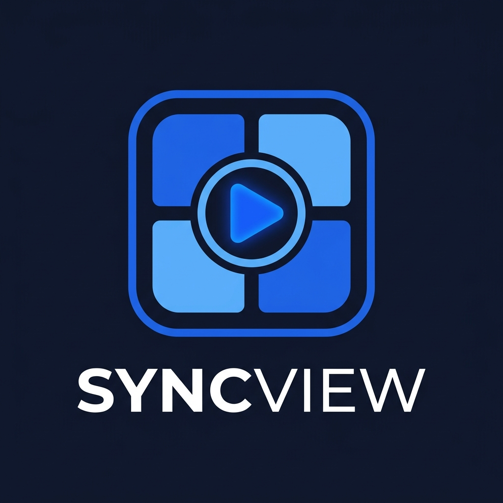
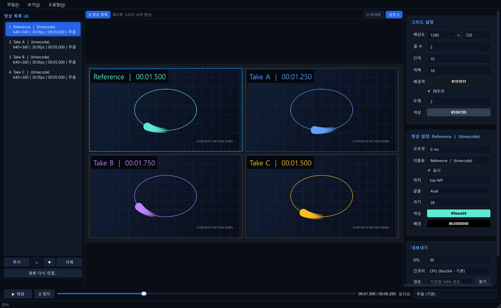

# SyncView

**한국어** | [English](README.en.md)

## 비교는 한 화면에서. 공유는 하나의 MP4로.

여러 결과 영상을 함께 재생하고, 시작 시각을 맞추고, 이름표를 붙여 전달하세요. **SyncView는 로컬 영상의 비교부터 공유용 MP4 제작까지 이어지는 Windows 데스크톱 도구**입니다.

**한 재생바로 함께 탐색 · 영상별 시간 조정 · 편집 가능한 프로젝트 · 로컬 처리**

[설치하고 실행하기](#개발-환경-설치) · [사용 순서](#사용-순서) · [단축키](#단축키) · [선택 기준과 비교 검토](docs/POSITIONING.md)

*합성 테스트 클립 4개를 실제 앱에서 재생한 화면입니다. 영상별 이름표와 타임코드를 MP4에도 포함할 수 있습니다.*

## 이런 작업에 써보세요

| 하려는 작업 | SyncView로 만들 수 있는 결과 |
|---|---|
| 모델·필터·렌더링 시안 비교 | 여러 후보를 같은 화면에서 보고 설정명을 붙인 비교 영상 |
| 서로 다른 시점에 시작한 촬영 테이크 비교 | 영상별 오프셋을 수동 조정한 동시 재생 화면 |
| 회의·보고·피드백용 자료 제작 | 보는 사람이 별도 도구 없이 재생할 수 있는 하나의 MP4 |
| 같은 비교 작업을 다시 수정 | 순서·배치·시간·디자인이 저장된 JSON 프로젝트 |

앱 사용에 가입이나 영상 업로드가 필요 없고 원본 파일을 수정하지 않습니다. 가로·세로 영상이 섞여 있어도 비율을 유지해 배치하고, 한글·공백 경로와 한글 이름표를 지원합니다.

**시작 조건:** Windows x64, 현재 한국어 UI. GitHub에서는 소스를 제공하므로 아래 설치 절차가 필요합니다. 단일 EXE 빌드도 지원합니다. 정밀 화질 분석이나 프레임 단위 계측용 도구가 필요한 경우에는 [동작 범위와 제한](#동작-범위와-제한)을 먼저 확인하세요.

## 주요 기능

| 기능 | 설명 |
|---|---|
| 멀티뷰 | 영상 추가·삭제·순서 변경, 자동 그리드와 열 수 지정, 원본 비율 유지 |
| 동기 재생 | 전체 재생·일시정지·탐색, 영상별 밀리초 오프셋, 짧은 영상의 마지막 프레임 유지 |
| 디자인 | 배경색·간격·여백, 테두리 표시·두께·색상, 영상별 이름표·글꼴·크기·색상·위치 |
| 이름표 매크로 | 파일명, 타임코드, FPS, 해상도, 오프셋을 문구에 삽입 |
| 보기 | 셀 더블클릭으로 솔로 보기, 좌우 패널 숨김, 미리보기 영역 확대 |
| 오디오 | 기본 무음, 선택한 영상 하나의 소리만 재생·export |
| 프로젝트 | JSON 저장·복원, 상대경로 저장, 이동하거나 누락된 원본 다시 연결 |
| MP4 export | H.264/AAC, 24·30·60fps, 출력 크기 지정, 진행률·취소, 기존 파일 보호 |
| 인코더 | 기본 CPU(libx264), 선택적으로 NVIDIA NVENC·Intel QSV |
| 독립 실행 | Python과 미디어 도구를 포함하는 단일 SyncView.exe 빌드 |

## 사용 순서

1. **추가** 버튼이나 파일 드래그앤드롭으로 영상을 불러옵니다.
2. 목록의 ▲·▼로 순서를 바꾸고 오른쪽에서 그리드와 출력 크기를 조정합니다.
3. 영상을 선택하여 오프셋·이름표·글꼴을 설정합니다.
4. 하단에서 함께 재생하고 필요하면 오디오 영상을 선택합니다.
5. **파일 → 저장**으로 프로젝트를 저장합니다. 원본 경로가 바뀌면 영상을 선택하고 **원본 다시 연결**을 사용합니다.
6. 저장 경로·FPS·인코더를 선택하고 **내보내기**를 누릅니다.

프로젝트는 영상 파일 자체를 포함하지 않습니다. 다른 PC로 옮길 때는 원본도 함께 옮기거나 다시 연결해야 합니다.

### 시간과 이름표

원본 시각은 **공통 시각 − 오프셋**입니다. +1000ms는 공통 시각 1초부터 원본의 처음을 재생하고, -1000ms는 원본의 첫 1초를 건너뜁니다. 시작 전 셀은 배경색이며 끝난 영상은 마지막 장면을 유지합니다. 전체 길이는 오프셋 반영 후 가장 늦게 끝나는 영상에 맞춥니다.

| 매크로 | 예시 |
|---|---|
| {filename} | Front_Camera |
| {timecode} | 00:12.300 — 해당 영상의 현재 원본 시각 |
| {fps} | 30fps |
| {resolution} | 1920x1080 |
| {offset} | 1000ms |

예: {filename} [{timecode}]. 타임코드는 export에서도 시간에 따라 바뀝니다. 긴 문구는 셀 너비에 맞춰 말줄임 표시합니다.

### 단축키

| 키 | 동작 |
|---|---|
| Space | 재생·일시정지 |
| ← / → | 100ms 탐색 |
| Shift + ← / → | 1초 탐색 |
| Home | 처음으로 |
| M | 선택 영상의 시작을 현재 공통 시각에 배치 |
| Delete | 선택 영상 삭제 |
| Ctrl+N / Ctrl+O / Ctrl+S | 새 프로젝트 / 열기 / 저장 |
| Ctrl+Shift+S | 다른 이름으로 저장 |
| Ctrl+1 / Ctrl+2 | 영상 목록 / 설정 패널 표시 |
| F11 | 좌우 패널을 숨겨 미리보기 영역 확대 |
| F1 | 사용 설명서 |

텍스트 입력 등 편집 위젯이 키를 처리하는 동안에는 해당 위젯의 동작을 우선합니다. 솔로 보기와 선택 테두리는 미리보기 전용이며 저장된 그리드를 바꾸지 않습니다.

## 개발 환경 설치

Windows x64와 **Python 3.12 x64**가 필요합니다. Git으로 저장소를 복제하거나 GitHub에서 ZIP으로 내려받아 압축을 풉니다.

~~~powershell
git clone https://github.com/Rainbow-Tools/SyncView.git
cd SyncView
~~~

아래 명령은 저장소 루트의 PowerShell에서 실행합니다. venv를 활성화하지 않고 실행 파일 경로를 직접 사용합니다.

~~~powershell
py -3.12 -m venv .venv
.\.venv\Scripts\python.exe -m pip install -c constraints.txt -e ".[dev]"
powershell -NoProfile -ExecutionPolicy Bypass -File scripts/setup_ffmpeg.ps1
.\.venv\Scripts\python.exe -m videos_multi_view
~~~

Python Launcher가 없다면 설치한 Python 3.12의 전체 경로로 첫 명령을 실행하세요. 검증 버전은 constraints.txt에 고정되어 있습니다.

FFmpeg 실행 파일은 Git에 포함되지 않습니다. 준비 스크립트는 검증된 9.0.2 Windows 빌드를 받아 SHA256을 확인하고 vendor/ffmpeg에 배치합니다. 수동 설치·오프라인 ZIP 사용 방법과 체크섬은 [미디어 도구 안내](vendor/ffmpeg/README.md)를 참고하세요. 개발 실행은 PATH의 FFmpeg도 찾을 수 있지만 EXE 빌드에는 지정 위치의 두 실행 파일이 필요합니다.

## 테스트와 빌드

~~~powershell
.\.venv\Scripts\python.exe -m pytest -q
.\.venv\Scripts\python.exe -m ruff check .
.\.venv\Scripts\python.exe -m ruff format --check .
.\.venv\Scripts\python.exe -m PyInstaller VideoMultiView.spec
~~~

결과는 **dist/SyncView.exe**입니다. 단일 EXE는 실행할 때 포함된 라이브러리를 임시 폴더에 해제하므로 시작에 시간이 걸릴 수 있습니다.

기본 테스트는 FFmpeg로 생성한 작은 영상으로 실행하며 개인 test_assets는 필요하지 않습니다. FFmpeg가 없으면 미디어 fixture를 사용하는 테스트는 건너뜁니다. 전체 검증 전에는 미디어 준비 스크립트를 실행하세요.

~~~powershell
# 개인 영상이 로컬에 있을 때 추가 검증
.\.venv\Scripts\python.exe -m pytest -q --local-assets

# 렌더링 측정. 결과는 Git에서 제외되는 artifacts에 저장합니다.
.\.venv\Scripts\python.exe scripts/benchmark_render.py
~~~

[검증 기록](docs/VALIDATION.md)에 실제 실행 결과와 측정 범위를 기록합니다.

## 구조

- core: Qt와 분리된 프로젝트 모델, 시간·그리드 계산.
- media: 메타데이터 분석, 재생, 비동기 FFmpeg export.
- application: 설정 검증, 프로젝트 입출력, 작업 수명 관리.
- ui: 창·패널·미리보기와 공통 이름표 렌더러.
- tests: 단위·UI·합성 영상 통합 테스트.
- scripts: FFmpeg 준비와 렌더링 측정 도구.

구현 기준은 [기획문서](docs/PLAN.md), 기여 규칙은 [AGENTS.md](AGENTS.md)를 참고하세요.

## 동작 범위와 제한

- 미리보기는 일반 비교용입니다. 100ms 이내 동기 오차는 측정 목표이며 프레임 단위 분석을 보장하지 않습니다.
- 영상 수는 고정하지 않지만 여러 고해상도 영상의 실시간 성능은 CPU·GPU·메모리와 코덱에 따라 달라집니다.
- H.264 export는 손실 압축입니다. 배치와 이름표 렌더러는 공유하지만 압축·색 변환에 따른 픽셀 차이가 생깁니다. 동적 타임코드는 정적 이름표보다 export 비용이 큽니다.
- GPU 인코더에는 호환 GPU와 드라이버가 필요합니다. 실패하면 CPU를 선택하세요. CPU로 자동 변경하지 않습니다.
- 여러 영상의 미리보기가 멈추거나 늦어지면 `python -m videos_multi_view --software-decode` 또는 `SyncView.exe --software-decode`로 소프트웨어 디코딩을 선택할 수 있습니다. export 인코더 선택에는 영향을 주지 않습니다. 기준 장비의 9개 재생 측정은 이 옵션에서 안정적이었습니다.
- 글꼴 파일은 포함하지 않습니다. 설치된 글꼴을 선택하며 다른 PC에서는 대체 글꼴이 사용될 수 있습니다.
- MP4 캔버스는 불투명합니다. 이름표 배경의 투명도는 지원합니다.
- PNG export, 자유 배치 편집, 다중 오디오 혼합, 자동 업데이트는 제공하지 않습니다.

## GitHub에 포함되는 파일

소스, 테스트, 문서, 로고, constraints 및 빌드 설정을 포함합니다. 개발 가상환경, 캐시, scratch, 개인 영상, export 결과, FFmpeg 실행 파일, dist는 .gitignore로 제외합니다. 사용자 프로젝트를 projects 폴더에 저장하면 Git에서 제외됩니다.

## 라이선스

SyncView 자체 코드와 문서는 **[MIT 라이선스](LICENSE)**입니다. 저작권·라이선스 고지를 보존하면 상업적 사용, 수정, 재배포가 가능합니다.

외부 구성요소에는 각 라이선스가 별도로 적용됩니다. export용 FFmpeg CLI는 GPLv3-or-later, Qt의 미리보기용 FFmpeg는 LGPL-2.1-or-later이며 PySide6/Qt의 사용 모듈은 LGPLv3 조건을 따릅니다. EXE를 재배포하려면 고지뿐 아니라 대응 소스와 Qt 재결합 등 해당 조건도 충족해야 합니다. [외부 구성요소 고지](THIRD_PARTY_NOTICES.md)와 [검토 결과·바이너리 배포 준비 범위](docs/LICENSING.md)를 확인하세요.
